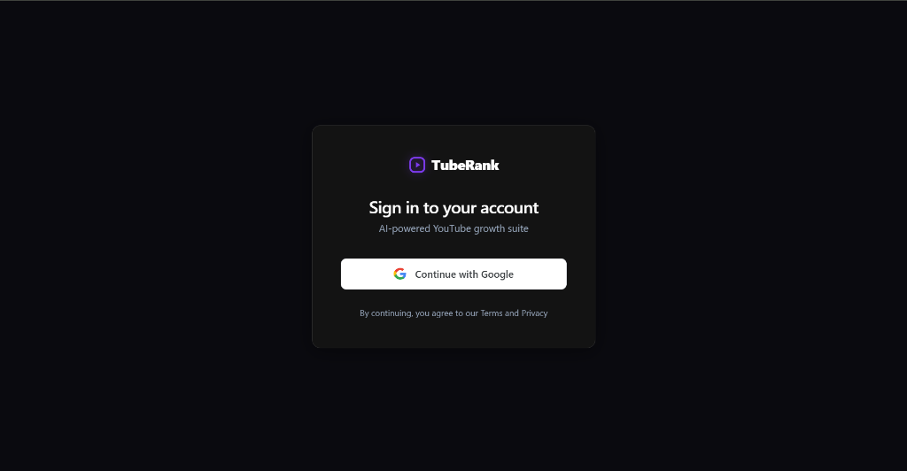
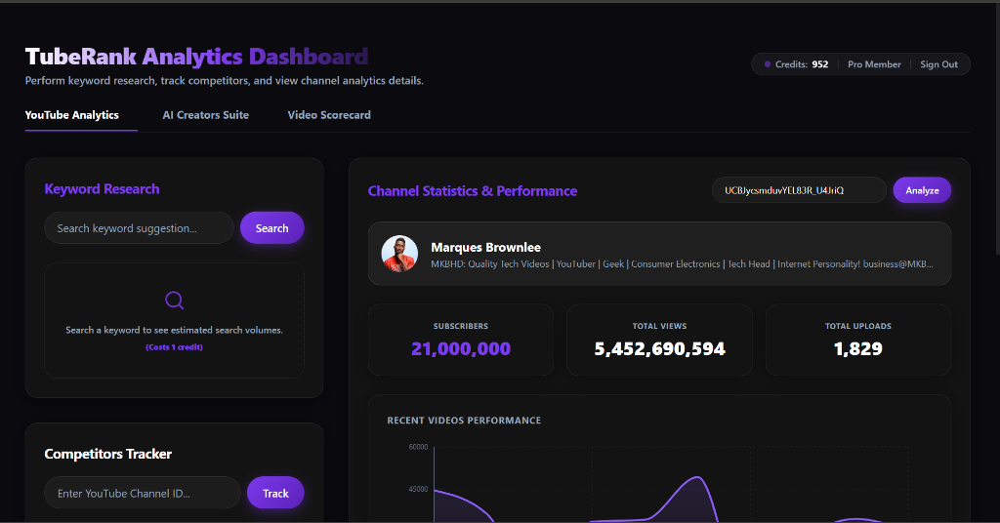

# TubeRank — AI-Powered YouTube Creator Growth Platform

[](https://tube-ranker.vercel.app)
[](https://nextjs.org/)
[](https://www.typescriptlang.org/)
[](https://developers.google.com/youtube/v3)
[](./LICENSE)

TubeRank is an AI-powered SaaS platform that helps YouTube creators grow their channels by providing keyword research, competitor analysis, video performance insights, and AI-generated content recommendations powered by Google Gemini.

🌐 Live Demo: [https://tube-ranker.vercel.app](https://tube-ranker.vercel.app)

---

## Screenshots

| Login Page | Analytics Dashboard |
| :---: | :---: |
|  |  |

---

## Tech Stack

| Layer         | Technology                       |
| ------------- | -------------------------------- |
| Framework     | Next.js 14 (App Router)          |
| Language      | TypeScript (strict mode)         |
| Database      | PostgreSQL 16 (via Prisma ORM)   |
| Cache / Queue | Redis 7                          |
| Auth          | NextAuth.js (Google OAuth)       |
| AI            | Google Gemini                    |
| Payments      | Stripe                           |
| Email         | Resend                           |
| Observability | Sentry + PostHog + OpenTelemetry |

---

## Prerequisites

- [Node.js](https://nodejs.org/) >= 20
- [Docker Desktop](https://www.docker.com/products/docker-desktop/) (for local Postgres + Redis)
- [Git](https://git-scm.com/)

---

## Setup Instructions

### 1. Clone the Repository

```bash
git clone https://github.com/HaiderAli1076/TubeRanker.git
cd TubeRanker
```

### 2. Install Dependencies

```bash
npm install
```

### 3. Configure Environment Variables

```bash
cp .env.example .env
```

Open `.env` and fill in each value. See `.env.example` for where to obtain each credential.

### 4. Start the Database & Redis (Docker)

```bash
docker compose up -d
```

This starts:

- **PostgreSQL 16** on port `5432`
- **Redis 7** on port `6379`

### 5. Run Database Migrations

```bash
npx prisma migrate dev --name init
```

This creates all tables and indexes in your local Postgres instance.

### 6. Generate Prisma Client

```bash
npx prisma generate
```

### 7. Start the Development Server

```bash
npm run dev
```

Open [http://localhost:3000](http://localhost:3000) in your browser.

---

## Available Scripts

| Command               | Description                      |
| --------------------- | -------------------------------- |
| `npm run dev`         | Start Next.js development server |
| `npm run build`       | Build production bundle          |
| `npm run lint`        | Run ESLint                       |
| `npm run format`      | Format all files with Prettier   |
| `npm run type-check`  | Run TypeScript type checking     |
| `npm run db:generate` | Regenerate Prisma client         |
| `npm run db:migrate`  | Run Prisma migrations            |
| `npm run db:studio`   | Open Prisma Studio               |

---

## Project Structure

```
TubeRanker/
├── prisma/
│   ├── schema.prisma         # Database schema (all models + indexes)
│   └── migrations/           # Generated SQL migrations
├── src/
│   ├── app/                  # Next.js App Router pages & API routes
│   │   ├── api/              # API endpoints (admin, ai, auth, channels, competitors, extension, gdpr, jobs, keywords, scorecard, user, webhooks)
│   │   ├── dashboard/        # Creator analytics & tool suite dashboard page
│   │   ├── login/            # Sign in / Google OAuth gateway page
│   │   ├── onboarding/       # Channel onboarding wizard flow
│   │   ├── layout.tsx        # Global page layout & desktop/mobile nav
│   │   └── page.tsx          # Homepage / landing page redirect
│   ├── components/           # Reusable UI components (TopNav, BottomNav, buttons)
│   ├── hooks/                # Custom React hooks (useCountUp, etc.)
│   ├── lib/                  # Core modules & configurations
│   │   ├── ai/               # AI engines (Groq client, inline executor, prompts, schemas)
│   │   ├── auth.ts           # NextAuth configuration and cookie settings
│   │   ├── env.ts            # Zod env validation (fail-fast on startup)
│   │   ├── prisma.ts         # Prisma singleton client with tenant hooks
│   │   └── youtube.ts        # YouTube API wrapper with Redis caching
│   ├── styles/               # CSS global design tokens
│   ├── utils/                # Serialization & helper utilities
│   └── workers/              # Background task workers (aiWorker, creditReset)
├── workers/                  # Legacy/root worker scripts (creditReset)
├── prisma.config.ts          # Prisma 7 configuration file
├── docker-compose.yml        # Postgres 16 + Redis 7 services
├── .env.example              # Environment variable template
├── .eslintrc.json            # ESLint rules (strict)
├── .prettierrc.json          # Prettier formatting configuration
├── tsconfig.json             # TypeScript compiler settings
└── README.md
```

---

## Environment Variables

All variables are validated at startup via Zod in `src/lib/env.ts`.
The app will **refuse to start** if any required variable is missing or invalid.

See `.env.example` for the full list with comments on where to obtain each value.

---
## Phases Roadmap

| Phase          | Scope                                                   |
| -------------- | ------------------------------------------------------- |
| **Phase 0** ✅ | Scaffold — Next.js, Docker, Prisma, Env validation      |
| **Phase 1** ✅ | Auth — NextAuth, Google OAuth, session management       |
| **Phase 2** 🟡 | Billing — Stripe webhooks & credit ledger (no UI/checkout routes yet) |
| **Phase 3** ✅ | YouTube Integration — channel stats, uploads & keyword volume ingestion |
| **Phase 4** ✅ | AI Engine — Groq Llama-3.3 creators suite (inline API generation) |
| **Phase 5** ✅ | Competitor Tracking — track/untrack rivals & content gap API |
| **Phase 6** ✅ | Dashboard — analytics UI, competitor trackers, charts & AI suite |
| **Phase 7** 🟡 | Workspace & Teams — Prisma model schema (no API routes or UI yet) |
